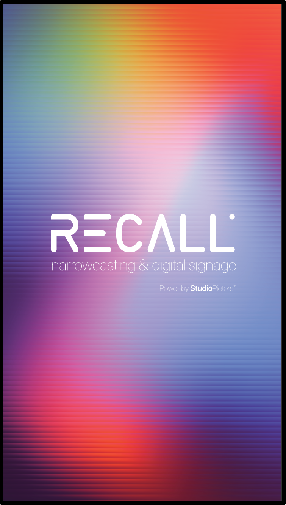

# Recall

Recall is a production-oriented digital signage platform with an enterprise migration path toward a modular, secure, multi-tenant architecture.

## Architecture at a glance
- **API/backend**: FastAPI + service/repository layering.
- **Persistence**: PostgreSQL + SQLAlchemy + migrations.
- **Async workloads**: Celery + Redis.
- **Device layer**: agent heartbeat, playback, metrics and remote operations.
- **Observability**: Prometheus/Grafana/Loki target stack.

See the detailed architecture blueprint in [`docs/architecture.md`](docs/architecture.md).

## Repository overview (current + target)
- `recall-server/`: current backend/runtime.
- `recall-player/`: current agent runtime.
- `docs/`: architecture, API, security, deployment and runbooks.
- `docs/recall-v2-enterprise-structure.md`: target v2 directory architecture.
- `docs/engineer-implementation-checklist.md`: phase-based engineer checklist.

## Development quick start
```bash
python -m pip install -r recall-server/requirements.txt
cd recall-server
uvicorn recall.api.main:app --host 0.0.0.0 --port 8000
```

## Configuration
- Copy `.env.example` to `.env` and set production-grade secrets (`JWT_SECRET`, DB credentials).
- For local parity, use PostgreSQL and Redis defaults from `docker/docker-compose.yml`.

## Testing and quality
From `recall-server/`:
```bash
ruff check recall tests
black --check recall tests
mypy --ignore-missing-imports recall
bandit -q -r recall -lll
pytest -q
```

## Deployment
- Local/container install helpers: `install-docker.sh`, `install-pi.sh`, `install-x86.sh`.
- See [`docs/deployment.md`](docs/deployment.md) for deployment guidance.

## Security
- Responsible disclosure policy: [`SECURITY.md`](SECURITY.md).
- Security architecture and controls: [`docs/security.md`](docs/security.md).

## Product screenshot

